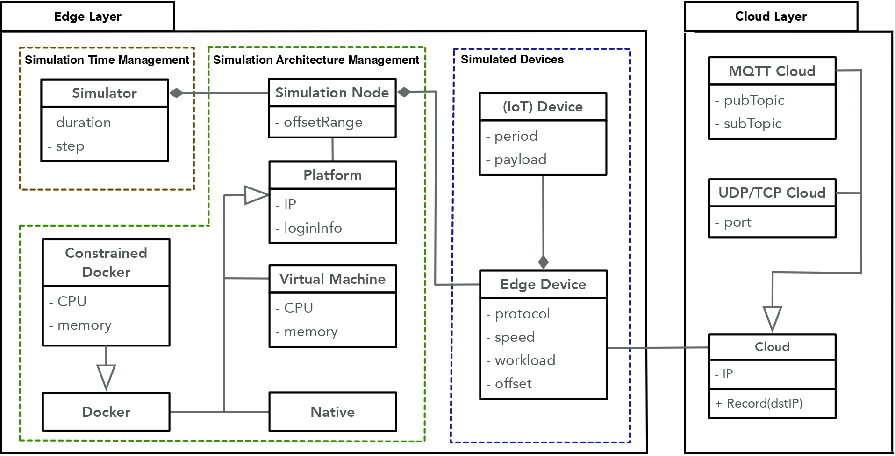

# IoTECS(IoT Edge-to-Cloud Simulation) -- A Domain-Specific Language for Simulation-Based Testing of IoT Edge-to-Cloud Solutions

This repository hosts the `A Domain-Specific Language for Simulation-Based Testing of IoT Edge-to-Cloud Solutions` paper. The main focus of the project is the `IoTECS` domain-specific language (DSL) designed to simulate edge-to-cloud interactions for testing IoT systems. 

The repository contains the complete `IoTECS` DSL codebase, including user interface files, testing scripts, and configuration files. It also includes the results of various experiments conducted as part of the project, stored in the `results` directory.

Additionally, the repository contains configuration files related to `JMeter` and `Locust`, popular stress testing tools used in the project for comparative evaluation against the `IoTECS` simulator. The files pertaining to these tools are located in the `baselines` directory.




## Abstract

The Internet of Things (IoT) is increasingly prevalent in domains such as emergency response, smart cities and autonomous vehicles. Simulation plays a key role in the testing of IoT systems, noting that field testing of a complete IoT product may be infeasible or prohibitively expensive. In this paper, we propose a \emph{domain-specific language (DSL)} for generating edge-to-cloud simulators. An edge-to-cloud simulator executes the functionality of a large array of edge devices that communicate with cloud applications. Our DSL, named IoTECS, is the result of a collaborative project with an IoT analytics company, Cheetah Networks. 
The industrial use case that motivates IoTECS is ensuring the scalability of cloud applications by putting them under extreme loads from IoT devices connected to the edge. We implement IoTECS using Xtext and empirically evaluate its usefulness. We further reflect on the lessons learned.

## Directory Structure

```bash
├── baselines
│   ├── JMeter
│       ├── Stores files for the JMeter stress testing simulation.
│   ├── Locust
│       ├── Stores files for the Locust stress testing simulation.
├── IoTECS
│   ├── This is the core directory for the IoTECS simulator.
├── figs
│   ├── This directory stores images used in the study.
├── results
│   ├── Contains results for research question 1, 2, 3 and 4.
└──


```

## Prerequisites

Before starting, please make sure that the following tools have already been installed:

- Eclipse 2021-12
- JDK 11
- Virtual Box 6.1
- Docker 20.10.11
- Xtext 2.25.0 ([Download](https://www.eclipse.org/Xtext/))
- Xtend 2.25.0 ([Download](https://www.eclipse.org/Xtend/))
- Ubuntu 20.04 disc image ([Download](https://ubuntu.com/download/desktop/))
- TShark (Wireshark) 3.4.9
- Python 3.8.8
- SSH
- JMeter ([Download](https://jmeter.apache.org/))
- Locust ([Download](https://locust.io/))


## Installation and Running Steps

Follow these steps to perform simulation-based testing for IoT Cloud applications using IoTECS:

1. Extract the contents of `IoTECS.zip` and open all the projects in Eclipse.
2. Navigate to `iotecs->src->iotecs->IoTECS.xtext`, then run as "Generate Xtext Artifacts".
3. Go to `iotecs->src->iotecs->GenerateIoTECS.mwe2`, and run as "MWE2 Workflow".
4. Launch the DSL project (`iotecs`) as "Eclipse Applications", choosing to launch "Runtime Eclipse".
5. Create Ubuntu 20.04 virtual machines (via Virtual Box) for each platform of type "VM".
6. Install Python, JDK, and TShark on both the local machine and all remote platforms.
7. In the runtime Eclipse Platform, create a new Java project and a new file with an "iot" extension (e.g., `Demonstration/test.iot`). If asked to convert 'test' to an Xtext project, select "yes". Input the specific instance of the conceptual model for IoTECS according to the grammar or use the provided demonstration IoTECS project and modify it as necessary.
8. Save the file created in step 7. This will generate code and scripts in the "src-gen" directory of the project (e.g., `test->src-gen`).
9. Install OpenSSH and ensure that localhost, Platforms, and SimulationNodes can communicate using ssh and scp.
10. Navigate to the generated directory of the IoTECS project (`src-gen/`) and run `main.sh`.

## Running Baselines

This repository includes the necessary files to run simulations with JMeter and Locust, two popular stress testing tools. We use these two tools as baselines for comparative evaluation with IoTECS.

###  Stress Testing Using JMeter

The `baselines/JMeter` directory contains a JMeter test plan file (.jmx). To run this test plan, follow these steps:

1. Open JMeter: Open your command line interface, navigate to your JMeter bin directory, and start JMeter. On many systems, you can do this with the command `./jmeter`.
2. Open the Test Plan: In the JMeter GUI, go to `File > Open` and navigate to the `baselines/JMeter` directory in this repository. Select the `.jmx` file to open it.
3. Run the Test Plan: Click the "Start" button (green play symbol) in the JMeter GUI. JMeter will begin running the test plan.
4. View Results: After the test plan has been completed, you can view the results in the `Summary Report` or `Aggregate Report` section of the JMeter GUI.

###  Stress Testing Using Locust

The `baselines/Locust` directory contains a Python script (`locustfile.py`). Below are the steps to run a Locust simulation:

1. Open your command line interface and navigate to the `baselines/Locust` directory in this repository.
2. Run the Locust file with the following command: `locust -f locustfile.py`. This command starts the Locust master process.
3. Open a web browser and go to `http://localhost:8089`. This opens the Locust web interface.
4. Enter the number of users to simulate, the hatch rate (users to start per second), and the host to test. Then, click "Start swarming" to begin the test.
5. View Results: The Locust web interface updates in real-time with the test results.
